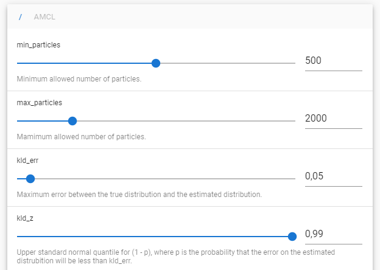

# vue-dynamic-reconfigure



Vue components for ROS [dynamic_reconfigure](http://wiki.ros.org/dynamic_reconfigure) that connect via websockets to a [rosbridge](http://wiki.ros.org/rosbridge_suite) running on your robot. The UI elements use [vuetify](https://v15.vuetifyjs.com/en/).

🖥 You can find a **[demo](https://ldwgwffnschmdt.github.io/vue-dynamic-reconfigure/)** here (only supports secure websockets over WSS).

## Install
```
npm install --save vue-dynamic-reconfigure
```

## Components
Includes the following conponents:
- **RosDynamicReconfigureList**: Shows a list of all Nodes supporting dynamic_reconfigure
- **RosDynamicReconfigureNode**: Used in RosDynamicReconfigureList, can also be used stand-alone to show the parameters of a single node

## Usage

```javascript
<template>
  <ros-dynamic-reconfigure-list :ros="ros"/>
</template>

<script>
import ROSLIB from 'roslib';
import RosDynamicReconfigureList from 'vue-dynamic-reconfigure';

export default {
  name:  'VueDynamicReconfigureDemo',
  components: {
    RosDynamicReconfigureList,
  },
  data: () => ({
    ros: null,
    connected: false
  }),
  mounted() {
    this.ros = new ROSLIB.Ros({
      url : 'ws://localhost:9090'
    });

    this.ros.on('connection', () => {
      this.connected = true;
    });
  }
}
</script>
```